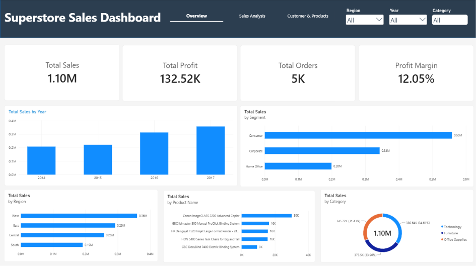
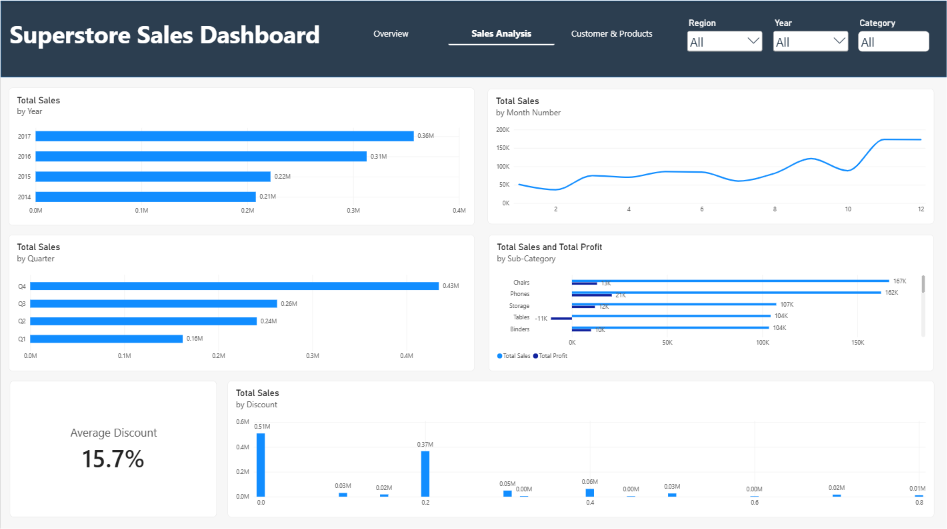
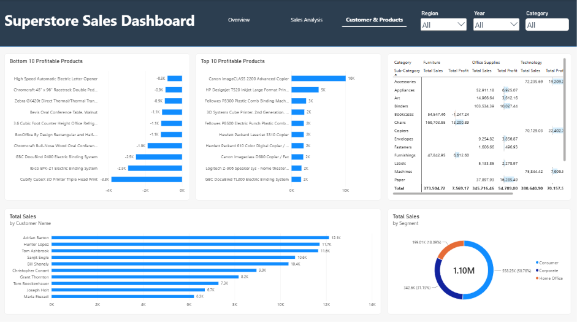

# Superstore Sales Power BI Dashboard

An interactive and professional 3-page Sales and Customer analytics dashboard built using **Power BI**, analyzing the standard "Sample - Superstore" dataset to uncover business insights, profitability trends, and customer behavior.

---

## Pages & Overview

### 1. Overview Page
Provides high-level executive KPIs and core metrics at a glance.
* **Key Metrics:** Total Sales (1.10M), Total Profit (132.52K), Total Orders (5K), and Profit Margin (12.05%).
* **Visuals:** Yearly sales growth, sales breakdown by Region, Segment, and Categories.

### 2. Sales Analysis Page
Deep dives into temporal performance and pricing dynamics.
* **Key Metrics:** Monthly and quarterly trends, sub-category profit vs. sales performance.
* **Highlights:** Includes a custom DAX-calculated **Average Discount (15.7%)** card and a distribution of sales across discount brackets.

### 3. Customer & Products Page
Focuses on identifying high-value entities and loss-making items.
* **Highlights:** Top 10 Profitable Products vs. Bottom 10 Profitable Products (losses), Top Customers, and a detailed Matrix table with conditional formatting (Data Bars).

---

## Tools & Techniques Used
* **Data Modeling & Cleaning:** Power Query.
* **Calculations:** DAX Measures (e.g., Average Discount, Profit Margins).
* **UI/UX Design:** Modern dark header layout, clean spacing, conditional formatting, and card structuring.

---
